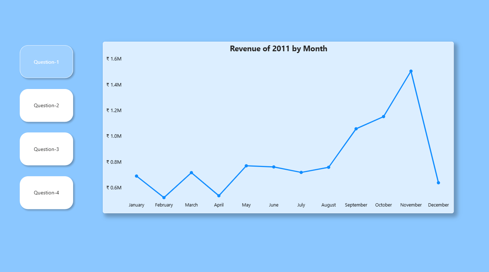
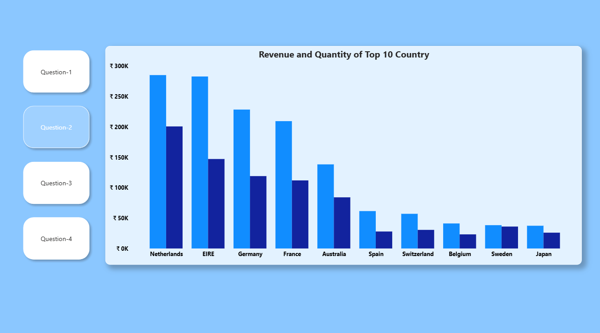
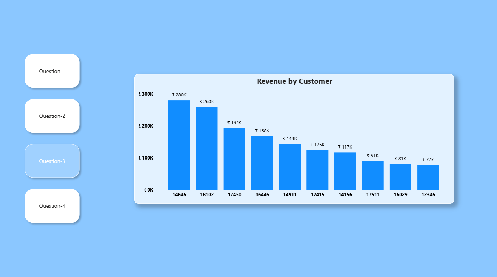
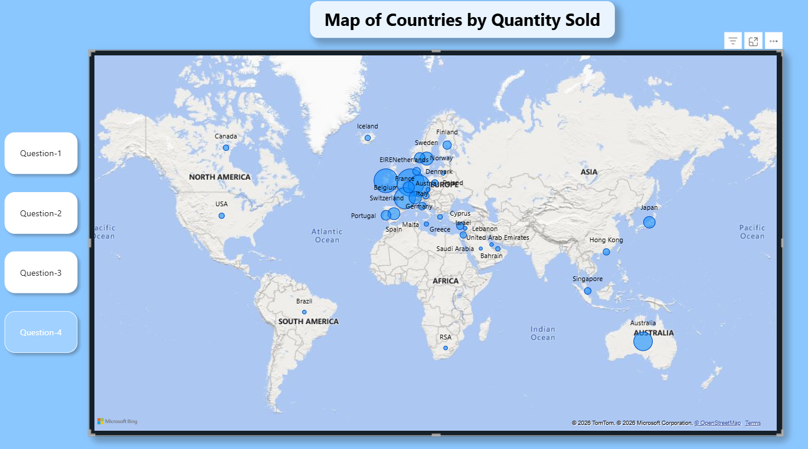

# 📈 Tata Data Visualisation — Virtual Internship

Completed as part of the **Tata Group Data Visualisation: 
Empowering Business with Effective Insights Virtual 
Internship** on Forage.

---

## 🏢 About the Internship

This virtual experience program simulates the work of 
a data analyst at Tata Consultancy Services (TCS). 
The task was to analyse an online retail dataset and 
create visualisations that answer specific business 
questions posed by the CEO and CMO.

---

## 📌 Business Context

An online retail company wanted to review its 2011 
performance data to support strategic expansion 
decisions. Leadership needed clear, visual answers 
to four key business questions.

---

## ❓ The Four Questions Answered

**Question 1 — Monthly Revenue Trend (2011)**
Which months performed best and worst for revenue?

**Question 2 — Top 10 Countries by Revenue & Quantity**
Which countries outside the UK generate the most 
revenue and volume?

**Question 3 — Top 10 Customers by Revenue**
Who are the highest-value customers the business 
should prioritise for retention?

**Question 4 — Global Quantity Sold by Country**
Where in the world is demand highest, 
visualised on a map?

---

## 📊 Visualisations

**Q1 — Revenue of 2011 by Month**

**Q2 — Revenue and Quantity of Top 10 Countries**

**Q3 — Revenue by Customer**

**Q4 — Map of Countries by Quantity Sold**

---

## 💡 Key Insights

- Revenue peaked in **November 2011** at ₹1.5M, 
  driven likely by holiday season demand
- **Netherlands and EIRE** are the top revenue-generating 
  countries outside the UK
- The top customer (ID: 14646) generated ₹280K — 
  nearly 4x the lowest in the top 10
- **Europe dominates** global quantity sold, with 
  minimal presence in Asia and Americas — 
  a potential expansion opportunity

---

## 🛠️ Tools Used

- Microsoft Excel (data cleaning and preparation)
- Power BI (all four visualisations)

---

## 🏆 Context

Completed via the **Tata Group Virtual Experience 
Program** on [Forage](https://www.theforage.com/) — 
a platform providing real-world work simulations 
from top global companies.
